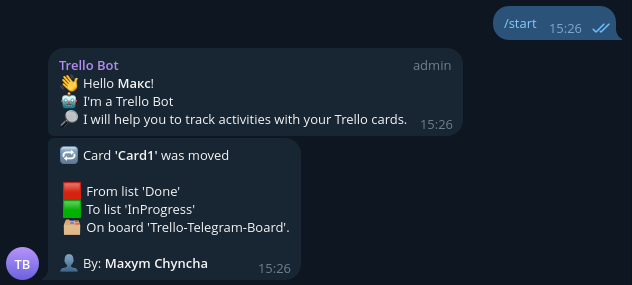

# Trello Telegram Bot

This Telegram bot integrates with Trello, allowing you to receive notifications in your Telegram chat about changes made to your Trello boards.

## Features
- **Real-time Updates**: Receive instant notifications in your Telegram chat when cards are moved between lists on your Trello boards.
- **Customizable**: Configure which Trello boards and lists you want to receive notifications for.
- **Webhook approach**: Utilizes webhooks to notify when users interact with cards.
- **Easy Setup**: Simple setup process to link your Trello account and Telegram chat.

## Tools and Technologies Used

* Programming language: `Python`
* Database: `PostgreSQL`, `asyncpg`, `SQLAlchemy`
* Telegram bot: `aiogram 3+`
* Asynchronous HTTP Client/Server: `aiohttp`
* Board management: `Trello API`

## Installation

To clone this project from GitHub, follow these steps:

1. **Open your terminal or command prompt.**
2. **Navigate to the directory where you want to clone the project.**
3. **Run the following commands:**
```shell
git clone https://github.com/MaxymChyncha/trello-telegram-bot
python -m venv venv
source venv/bin/activate  #for Windows use: venv\Scripts\activate
```

4. **Install requirements:**

```shell
pip install -r requirements.txt
```
5. **Get Tokens**

You can get Telegram Bot Key [here](https://t.me/BotFather).\
You can get Trello Token and Key [here](https://trello.com/power-ups/admin).

6. **Prepare your `.env` file with `env.sample`** example.

6. **Run the Application:**
```shell
python -m main
```

## Files Structure

- `main.py`: module for running project
- `bot/`: Package with Telegram bot setting
- `database/`: Package with Database settings
- `trello/`: Package with settings for Trello API
- `settings/`: Package with settings for project

